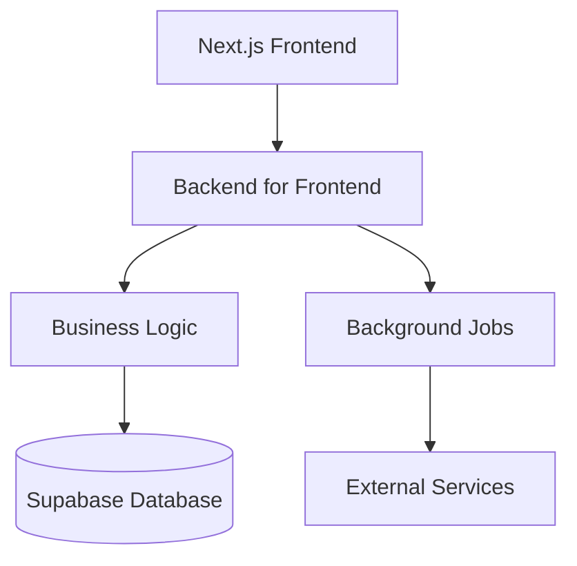

# AI-BOS Accounts Documentation

Welcome to the AI-BOS Accounts documentation! This is your comprehensive guide to understanding,
developing, and maintaining the AI-BOS accounting system.

## 🎯 What is AI-BOS Accounts?

AI-BOS Accounts is a modern, cloud-native accounting system built with Next.js, TypeScript, and
Supabase. It provides:

- **Complete Accounting Workflows**: AR, AP, GL, and financial reporting
- **Multi-tenant Architecture**: Secure, scalable, and compliant
- **Modern Tech Stack**: Next.js, TypeScript, Tailwind CSS, and more
- **Developer-First**: Comprehensive APIs, testing, and documentation

## 🚀 Quick Start

Get up and running in minutes:

```bash
# Install dependencies
pnpm install

# Start development
pnpm dev

# View documentation
pnpm docs:dev
```

## 📚 Documentation Structure

- **[Packages](/packages)** - Detailed package documentation
- **[API Reference](/api)** - Generated API documentation
- **[Guides](/guides)** - How-to guides and best practices

## 🏗️ Architecture Overview



## 📦 Core Packages

- **@aibos/accounting** - Core business logic and calculations
- **@aibos/ui** - React component library and design system
- **@aibos/utils** - Shared utilities and services
- **@aibos/contracts** - API contracts and type definitions
- **@aibos/db** - Database schema and operations
- **@aibos/auth** - Authentication and authorization

## 🔧 Development Tools

- **Documentation**: Nextra with live reload
- **API Docs**: TypeDoc with automatic generation
- **Testing**: Vitest, Playwright, and K6
- **Linting**: ESLint, Prettier, and Markdown linting
- **Versioning**: Changesets for package versioning

## 📈 Current Status

- ✅ **D2 Core Logic**: 100% Complete
- ✅ **Database Schema**: Ready for deployment
- ✅ **API Routes**: Complete with minor TODOs
- ⚠️ **Testing**: Pending integration tests
- 🔄 **Documentation**: In progress (this site!)

## 🤝 Contributing

We welcome contributions! Please see our [Contributing Guide](/guides/contributing) for details.

For documentation contributions, see our [Docs Contributing Guide](/guides/how-to-contribute).

## 📞 Support

- **GitHub Issues**: [Report bugs and request features](https://github.com/aibos/accounts/issues)
- **Discord**: [Join our community](https://discord.gg/aibos)
- **Email**: [Contact us](mailto:support@aibos.com)

---

**Last Updated**: September 14, 2025 • **Version**: 1.0.0
