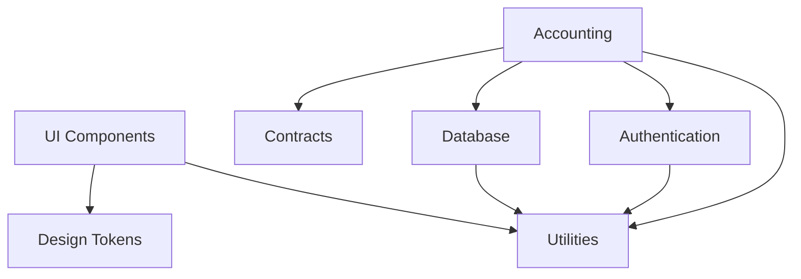

# Packages Overview

This section contains detailed documentation for all packages in the AI-BOS Accounts monorepo.

## 📦 Package Structure

Our monorepo is organized into focused, single-responsibility packages:

### Core Business Logic

- **[Accounting](./accounting)** - Core accounting logic, calculations, and business rules
- **[Contracts](./contracts)** - API contracts, types, and validation schemas

### User Interface

- **[UI Components](./ui)** - React component library and design system
- **[Tokens](./tokens)** - Design tokens and theme configuration

### Infrastructure

- **[Database](./db)** - Database schema, migrations, and operations
- **[Authentication](./auth)** - Authentication and authorization logic
- **[Utils](./utils)** - Shared utilities and helper functions

## 🔗 Package Dependencies



## 📋 Package Standards

All packages follow consistent standards:

- **TypeScript**: Full type safety and IntelliSense support
- **Testing**: Comprehensive test coverage with Vitest
- **Documentation**: Auto-generated API docs with TypeDoc
- **Linting**: ESLint and Prettier for code quality
- **Versioning**: Semantic versioning with Changesets

## 🚀 Getting Started

Each package can be used independently or as part of the complete system:

```bash
# Install a specific package
pnpm add @aibos/accounting

# Use in your code
import { createInvoice } from '@aibos/accounting'
import { Button } from '@aibos/ui'
```

## 📚 Package Documentation

Click on any package below to explore its detailed documentation:

- [Accounting Package](./accounting) - Business logic and calculations
- [UI Components](./ui) - React component library
- [Utilities](./utils) - Shared helper functions
- [Contracts](./contracts) - API types and validation
- [Database](./db) - Schema and operations
- [Authentication](./auth) - Auth logic and permissions
